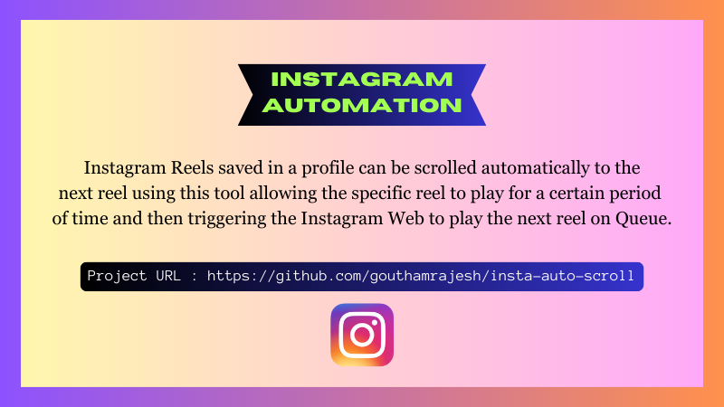

# insta-auto-scroll
## Automation for Instagram Auto Scroll



<br>

<p>
In instagram, while watching the saved feed in website there are two icons that helps us to navigate to the right side and left side of the page which significantly takes us to the next reel that we've saved. Each of these icons are svg files accordingto the front end of the instagram which is embedded inside a class "_abm0" which is embedded inside a button class "_abl-". But the challenging part is that this same button works as "Go Back" and "Next" button. But..., there is another class "_aaqf _aaqh" that handles the "Go Back" button and needful actions and " _aaqg _aaqh" which controls the "Next" button.
</p>

<p>
Inorder to play our Next reels in the saved portion all we have to do is to trigger that particular button class to be clicked under that respective parent class. All these actions need to be performed under a certain set of time, namely I've used 30 seconds in my simualtion.
</p>

## How to Implement ?


Step 1 : Go to Instagram Web<br>
Step 2 : Open 1st Reel in the saved reels<br>
Step 3 : Right Click and Open the Inspect Element -> Choose Console<br>
Step 4 : Paste the code in ``` index.js ``` in the console and wait for next 30 seconds to see the automation
Step 5 : Boom !!!! It works !!!!
